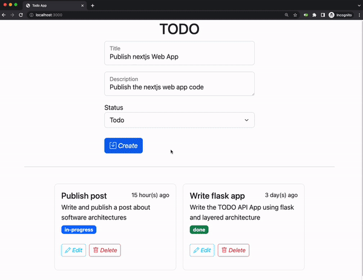

# Next.js TODO Web App

This Next.js TODO web app serves as the frontend for the TODO system, it's a simple, responsive web application that uses a layered architecture to manage TODOs. The application is built using React, Next.js, and TypeScript, and follows the best practices of a layered architecture for separation of concerns and maintainability.

<p align="center">
  
</p>

**Note:** This frontend application is designed to work in parallel with the backend service, which can be found in the following repository: https://github.com/herrera-luis/layered-flask-todo-service. To ensure that the frontend application works correctly, you must deploy the backend service as well.

If you want to get more context about this web app visit the post: [Software Architectures: Styles and Structure Partitioning](https://luisherrera.dev/software-architectures-styles-and-structure-partitioning#heading-todo-system-example)

## Requirements

* Node.js v16.8.0 or higher (Required by **Next.js 13**)
* npm or yarn package manager
## Features

* Add, update, and delete todos
* Responsive design suitable for both desktop and mobile devices
* Test suite with unit and integration tests
* Context-based state management for efficient data flow
* Modern, clean user interface

## Getting Started

1. Install dependencies:

```bash
npm install
```
or
``` bash
yarn install
```

2. Run the development server:

```bash
npm run dev
```
or

```bash
yarn dev
```

3. Open your browser and navigate to http://localhost:3000. The application should be running and ready for use.

## Runnint Tests

To run the test suite, use the following command:

```bash
npm test
```
or
```bash
yarn test
```

